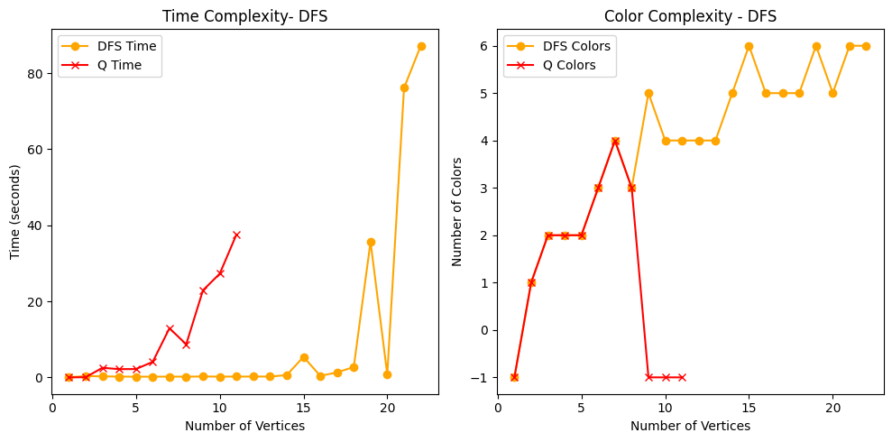
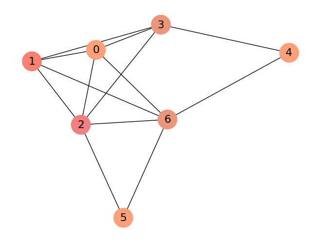
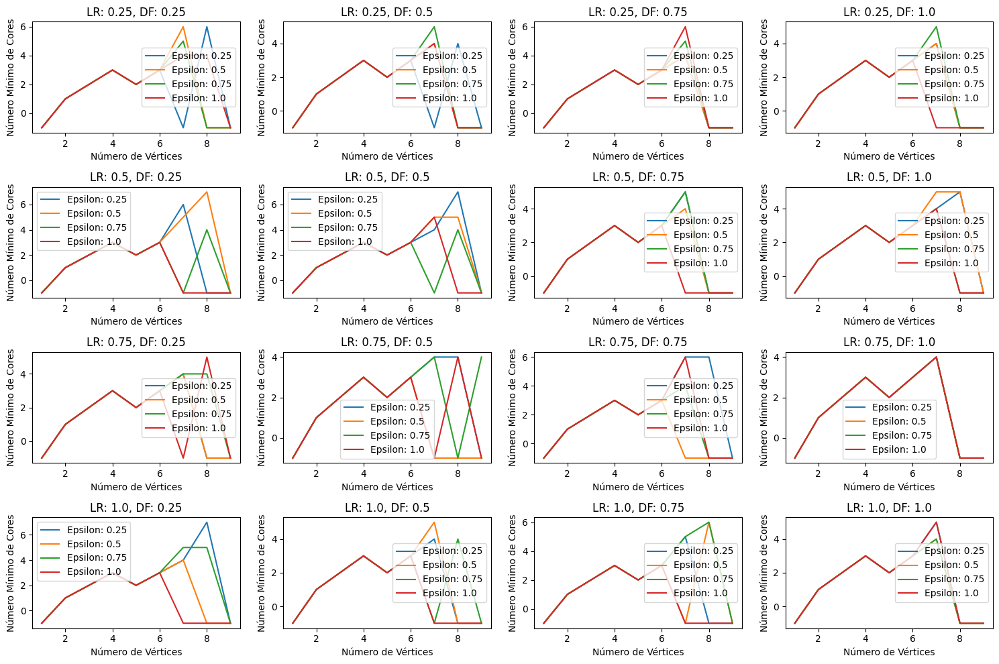

<h1 align="center">🦊 BFS and Q-Learning algorithm 🦊</h1>

<div align="center">
	<a href="link_for_webite">
	
    </a>
</div>

## Developed by 💻:

- [Fernando Schettini](https://linktr.ee/fernandoschett).

## About 🤔:

This project addresses the challenge of using Q-learning and DFS algorithms to distribute orange fox species in territories, ensuring that foxes of the same species cannot coexist in the same territory. The problem is modeled using graphs, where foxes represent vertices and edges connect foxes of the same species. The minimum number of colors required for proper vertex coloring corresponds to the number of territories needed. Coloring graphs is an NP-hard problem, implying that deterministic solutions (since there are no polynomial solutions to the problem) are quite computationally intensive. Therefore, the problem cannot grow significantly.

## Resourses 🧑‍🔬:

- **Graph Representation:** Visual representations of colored graphs, showcasing the distribution of fox species in different territories.
- **Coloring Algorithms:** Python DFS (Depth-First Search) and Q-Learning implementations are used to color the graphs.
- **Hyperparameter Analysis:** Analysis of hyperparameters, providing graphical images by iteratively varying hyperparameters.
- **Algorithm Complexities:** Analys includes time and space complexities for each implemented algorithm, aiding in understanding their efficiency.

## Results 📈:

As seen in figures 1, 2 and 3 in the analysis of hyperparameters, no consistent pattern for optimal combinations was observed, attributed to the small problem size and limited executions. Notably, DFS outperformed Q-learning in time and results, primarily because the Q-learning model's memory space complexity grows exponentially with the number of colors due to its specific formulation.

<div align="center">
	<a href="">
	
    </a>
</div>
<h4 align="center">Figure 1 - Comparison between DFS and Q-learning.</h4>

<div align="center">
	<a href="">
	
    </a>
</div>
<h4 align="center">Figure 2 - Colored graph visual.</h4>

<div align="center">
	<a href="">
	
    </a>
</div>
<h4 align="center">Figure 3 - Hyperparameter analysis.</h4>

## Dependencies 🚚:

The project dependencies are described in  ```./dependencies/requirements.txt``` within the repository. In summary, heres what you're gonna need in order to run the project:

- [```networkx 3.1```](https://networkx.org/).
- [```numpy 1.25.2```](https://numpy.org/).
- [```matplotlib 3.8.0```](https://matplotlib.org/). 

For installing dependencies more quickly, you can run the following command at terminal, inside the clonned repository:

	sudo apt update && sudo apt install python3 python3-pip
    pip3 install -r ./dependencies/requirements.txt

Make sure you have all Dependencies before running the project.

## How to run it 🏃:

First, clone this repository. After that, simply execute the ```fox_ia.ipynb``` file with the command:

    sudo jupyter notebook fox_ia.ipynb

### Tools Used 🛠️: 

- [VScode](https://code.visualstudio.com/). 
- [Jupyter Notebook](https://jupyter.org/)

## How to contribute 🫂:

Feel free to create a new branch, fork the project, create a new Issue or make a pull request contact one of us to develop at repo, inserting new algorithms and other analysis.

## Licence 📜:

[Apache V2](https://choosealicense.com/licenses/apache-2.0/)

